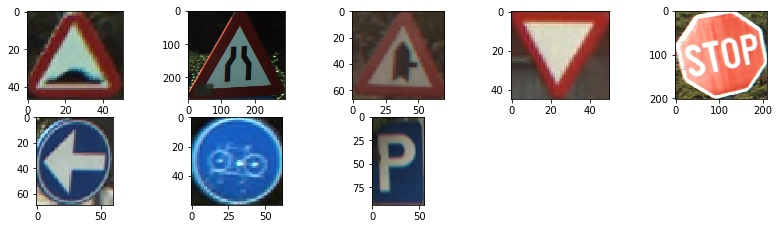

# Traffic-Sign-Recognition--HSV-SVM--BelgiumTSC
Traffic sign recognition is an advanced driver assistance system which can recognize road signs and display the corresponding information in the vehicle. It consists of two parts, Sign Detection and Sign Classification. In detection we will detect the coordinates and size of sign board in the image and in classification we try to find that what this signal represent or what class this signal belongs. In our case there are eight classes of sign boards that need to classify they are shown below:

Let describe the approach work in different steps to cover up the detection and classification as well.

## 1)	Sign Detection

### a. Median Blurring:

We apply Median Filter on each channel for removing the salt-and-pepper noise in the image. The output image and input shown below:

Figure(2): Input Image

Figure(3): Median Filter output

### b.	Contrast Normalization over Each Channel:
    We first do Normalization of RGB image each channel value range from 0 to 1, then apply contrast normalization in the range 0 to 1 by 
    applying below formula:

        Difference = img_channel.max() - img_channel.min()
        Contrast_Normalize_channel = (1/ Difference) *(img_channel- img_channel.min())

### c.	Normalize Image Blue and Red Channel Intensity:

We applied blue and red channel intensity normalization method that is describe in [1]. For each channel red or blue the formula is difference and Below outputs of each channel also shown:

 			 
As it can be clearly seen that there are no major red color in the image that why left side image has no major bright area.

### d.	Using Maximally Stable Extremal Regions - MSER algorithm:

    mser = cv2.MSER_create(_min_area=100,_max_area=10000)
    regions_ red, _ = mser.detectRegions(red_normalize.astype('uint8'))
    regions_blue, _ = mser.detectRegions(blue_normalize.astype('uint8'))

    we chose min area 100 and max area 10k for mser detection so that we don’t have too many noise and small regions. . Once MSER 
    regions are detected a binary image for both the red and green mser regions are formed as shown below.

### e.	Threshold in HSV color space:

The HSV Color Space serves better to identify appropriate bands for H, S, V channels to model the color composition of a traffic sign. Also it isolates intensity/brightness (unlike RGB) which helps with robustness to illumination. We choose colors ranges in HSV color space to extract these ranges.http://colorizer.org/. These ranges color Threshold Defined Below, after selecting these colors ranges we delete all other colors in the image and our image become binary. We only choose two channels saturation, lightness range of Red and blue to detect it. Note that we normalize the hsv image between 0 to 1 range.

### f.	Combining HSV with MSER:

To remove the false outcomes, we have used two combined approaches method in which we take common part of image in which HSV threshold image and MSER generated image and fill the inside area of connected region. In the proceeding image the red channel become zero as there are no common part in HSV and MSER. By this method more noise removed and accuracy of detection increased. The output is shown below:

### g.	Blob/Contours based image cropping:

We first applied blob or contours on the Combined image of HSV and MSER, and crop the image if the contour area is greater than 700 to avoid false readings. We have also use aspect ratio filter between 1.21 and 0.59, if the object aspect ratio matches it will then forward and crop the image on that base. We have also set the threshold on number of maximum contour will be detected in one image that is 5, means that if more than 5 contours detected at a time we will only choose bigger 5 contours based on the area. The crop image of sign board shown below:

## 2)	Sign Classification

### a.	Histogram of oriented gradients (HOG) Features from Traffic Sign:

HOG decomposes an image into small squared cells, computes an histogram of oriented gradients in each cell, normalizes the result using a block-wise pattern, and return a descriptor for each cell. We first apply median filter then reshape the crop image to [64,64]. We choose [4,4] size of cell so that we can preserve the shape information. HOG generates14112 features array. The output of HOG is shown below:

We Stack the cells into a squared image region used it as an image window descriptor for object detection, by SVM Classifier.

### b.	Principal Component Analysis(PCA):

As the HOG generate large number of features size of 14112, if we directly transfer to the classifier it will take more time and computation resources and it will also create the overfitting problem. To avoid this, we are using PCA, is a dimensionality-reduction method that is often used to reduce the dimensionality of large data sets, by transforming a large set of variables into a smaller one that still contains most of the information in the large set. Reducing the number of variables of a data set naturally comes at the expense of accuracy, but the trick in dimensionality reduction is to trade a little accuracy for simplicity. Because smaller data sets are easier to explore and visualize and make analyzing data much easier and faster for machine learning algorithms without extraneous variables to process.

After apply PCA for 40 components, we have remain small parameters that will process fast and required less resources.

### c.	SVM Classifier:

A Support Vector Machine (SVM) is a discriminative classifier formally defined by a separating hyperplane. In other words, given labeled training data (supervised learning), the algorithm outputs an optimal hyperplane which categorizes new examples. In two dimensional space this hyperplane is a line dividing a plane in two parts where in each class lay in either side.
One Example is shown in below pictures where you can see the data to divide into two dimensional space.

The learning of the hyperplane in linear SVM is done by transforming the problem using some linear algebra. This is where the kernel plays role. The kernel functions are used to map the original dataset (linear/nonlinear ) into a higher dimensional space with view to making it linear dataset. The linear, polynomial and RBF or Gaussian kernel are simply different in case of making the hyperplane decision boundary between the classes. Usually linear and polynomial kernels are less time consuming and provides less accuracy than the rbf or Gaussian kernels.

We first trained the classifier on the The Belgium Traffic Sign dataset, and test it accuracy on testing dataset shown below:
SVM Mean Accuracy of Training dataset:  0.9254054054054054
SVM Mean Accuracy of Test dataset:  0.8552338530066815

The cropped image features are forward to the SVM classifier which predict the class of sign board, that is displayed on the adjacent of Input image shown below:

## 3)	Drawbacks and Future Approach:

  a.	The system is not Robust as It detecting the same color other objects also as steet sign. Even we tried to use different threshold of width, hight and contours area but still some object detected other than street Signs.

  b.	The Future approach possible by using deep learning methods for object detection like yolo, faster RCNN.
